# 🏗️ Architecture

This page summarizes the **architecture** selected for deploying AzTier.

## 🌐 3-tier application architecture

AzTier uses a layered architecture with the following components:

<table>
    <tr>
        <th>Component</th>
        <th>Description</th>
    </tr>
    <tr>
        <td>Frontend</td>
        <td>Static vanilla JavaScript application for user interaction.</td>
    </tr>
    <tr>
        <td>Backend</td>
        <td>Python Flask application serving JSON files hosted on this repository via a Web API.</td>
    </tr>
    <tr>
        <td>Storage</td>
        <td>GitHub repository hosting configuration and data files (this repository).</td>
    </tr>
</table>

## ☸️ Containerized architecture

AzTier can be deployed in Azure Kubernetes Service (AKS) using the provided manifest and Dockerfiles located in the [`app`](https://github.com/emiliensocchi/aztier-deployer/tree/main/app) folder of this repository. 

The containerized architecture can be visualized as follows:

```mermaid
flowchart TD
    subgraph ContainerRegistry["Azure Container Registry (ACR)"]
        subgraph registry_repo_box["Repositories"]
            registry_frontend["aztier-frontend"]
            registry_backend["aztier-backend"]
        end
    end

    subgraph GitHub["GitHub"]
        subgraph github_repo_box["Repository"]
            github_repo["🌩️🚀 AzTier deployer (this repository)"]
        end
    end

    subgraph K8S["AKS Cluster"]
        subgraph Pod["Pod"]
            frontend[aztier-frontend]
            backend[aztier-backend]
        end
    end

    ContainerRegistry -- "Image Pull" <--> K8S
    backend -- "Get JSON Files" --> github_repo
    frontend -- API Request --> backend
```

