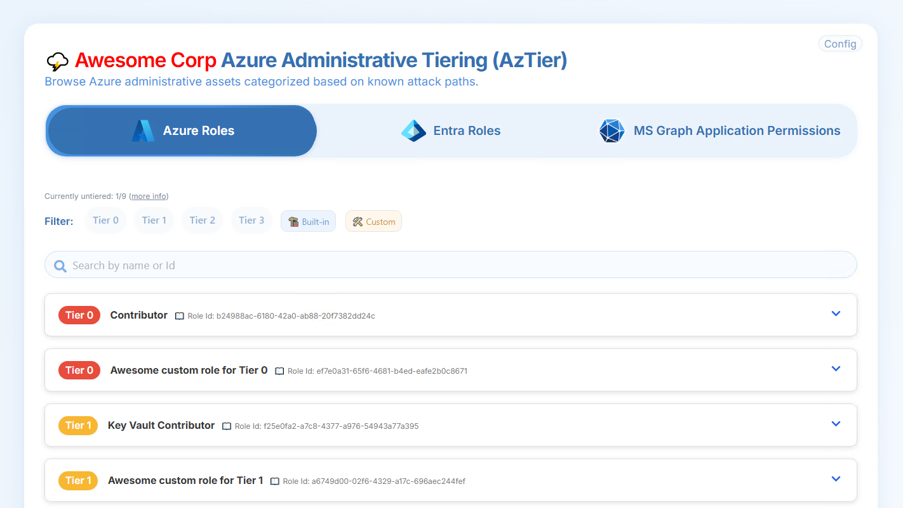

# 🎬 Demo

This directory contains static example files to demonstrate the use of AzTier.

## 👀 Preview 




## 🐳 Deploy AzTier locally in a container

### Step 1: Deploy AzTier

In a Linux or Windows terminal (Bash/PowerShell), run the following:

```
git clone https://github.com/emiliensocchi/aztier-deployer.git
```
```
cd aztier-deployer/example/app
```
```
docker run --rm -v "$PWD/aztier:/usr/share/nginx/html/:ro" -p 8000:80 nginx:latest
```

### Step 2: Browse to the AzTier frontend

In a web browser, navigate to: `http://localhost:8000`
