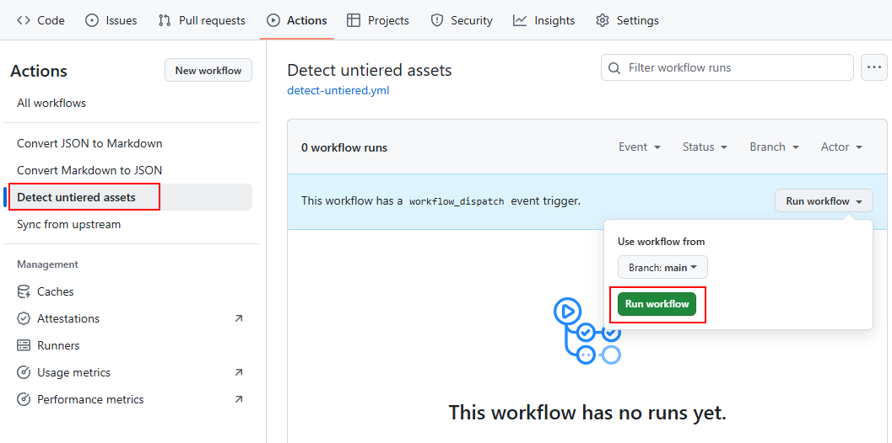

# 🚀 First run

This page summarizes the instructions to follow once AzTier is fully configured and ready to **run for the first time**.

## ▶️ 1. Run the GitHub workflows manually

Once this project has been forked and configured with your Entra tenant, run the following GitHub workflows **manually in that order** to populate the tier models:

### Workflow 1: "Sync from upstream"

### Workflow 2: "Detect untiered assets"

## 🎯 2. Expected results

At this point, the following should be in place:

1. All tier models are populated with built-in assets retrieved from [public AzTier](https://github.com/emiliensocchi/azure-tiering).

2. The untiered section of each model is populated with assets specific to the configured tenant. 

3. The next step is for the owner of this project to review untiered assets and categorize them based on known attack paths.
