# 🔀 Worfklow

This page summarizes the **workflow** executed by AzTier every 24 hours.

## 🔄 AzTier workflow

Once configured with your Entra tenant, this project triggers the following workflow **daily** at **01:00 am UTC**:

```mermaid
flowchart TD
    A[📦 Private AzTier repository] -->|"Get from public AzTier (upstream)"| B{**Tiered** assets}

    B --> C[**Common/In-use Built-in** <br> ☁️ Azure roles]
    B --> D[**All/In-use Built-in** <br> 👤 Entra roles]
    B --> E[**All/In-use Built-in** <br> 🤖 MS Graph application permissions]

    C -->|Merge to| F[📦 Private AzTier repository]
    D -->|Merge to| F[📦 Private AzTier repository]
    E -->|Merge to| F[📦 Private AzTier repository]

    F[📦 Private AzTier repository] -->|Get from configured <br>Entra tenant| G{**Untiered** assets}

    G --> H[**All Custom** <br> ☁️ Azure roles]
    G --> I[**All Custom** <br> 👤 Entra roles]
    G --> J["**In-use Built-in** <br> ☁️ Azure roles <br>(assigned in the configured tenant, but not tiered upstream)"]

    H -->|Merge to| K[📂 Azure roles / <br>📄 untiered-azure-roles.json]
    I -->|Merge to| L[📂 Entra roles / <br>📄 untiered-entra-roles.json]
    J -->|Merge to| K[📂 Azure roles / <br>📄 untiered-azure-roles.json]

    K-->|Located in| M[📦 Private AzTier repository]
    L-->|Located in| M[📦 Private AzTier repository]

    M -->|Reviewed for categorizing based on known attack paths by| N[👤 Internal AzTier project owner]
```

## 📃 High-level workflow description

1. Retrieve the latest changes from [public AzTier](https://github.com/emiliensocchi/azure-tiering) ("upstream"), and merge locally with this repository.

2. From the Entra tenant configured with this project, retrieve untiered assets and add them to the untiered sections of this repository.

3. The owner of this repository reviews untiered assets and categorizes them based on known attack paths.
